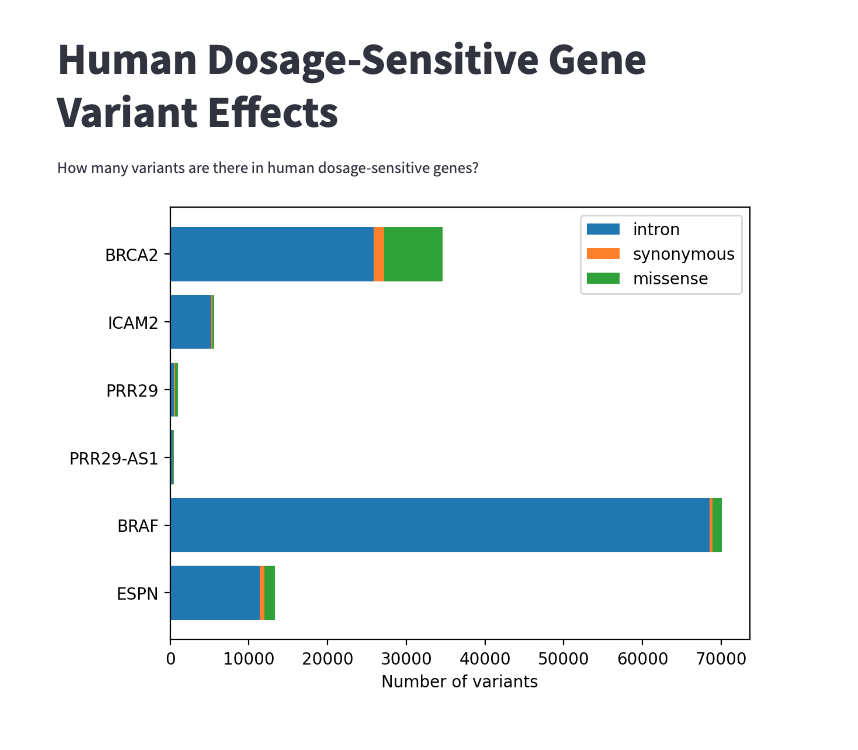

# Dosage-Sensitive Gene Variant Effects

This project utilizes the Ensembl REST API to retrieve variant effects for a set of human dosage-sensitive genes. These genes are known to cause abnormal functioning and diseases when their gene product (RNA or protein) levels increase or decrease due to various genetic alterations, such as duplications, deletions, or gain/loss-of-function mutations.

## Live demo
You can check it out [here](https://dosage-sensitive-gene-variants-zhpeqttzzjjfljaxhrj5kt.streamlit.app/).

## Current Functionality

- The list of genes to be queried is currently hard-coded in the main function.
- The program retrieves variant effects for these pre-defined genes using the Ensembl REST API.

## Future Enhancements

- Implement a drop-down menu to allow users to select specific genes for analysis.
- This feature will provide more flexibility and user control over the gene selection process.

## Getting Started

### Installation:
```zsh
# Clone the repository

git clone https://github.com/vitorpavinato/dosage-sensitive-genes-variants.git

# Install dependencies with poetry
poetry install
```

### Usage:
```zsh
# Activate the shell for the local virtual environment
poetry shell

# Run streamlit
streamlit run get_human_variant_effects.py
```

### Screenshot of the Streamlit App


## Dependencies

- Poetry >= 1.8.3

## License

This project is licensed under the MIT License. See the LICENSE file for details.